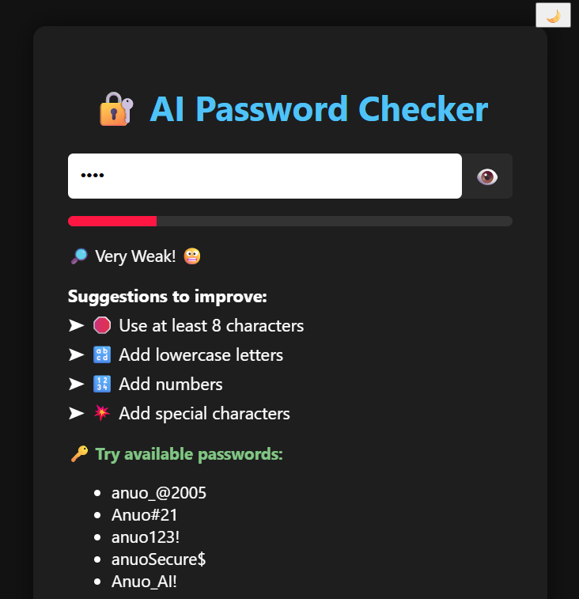
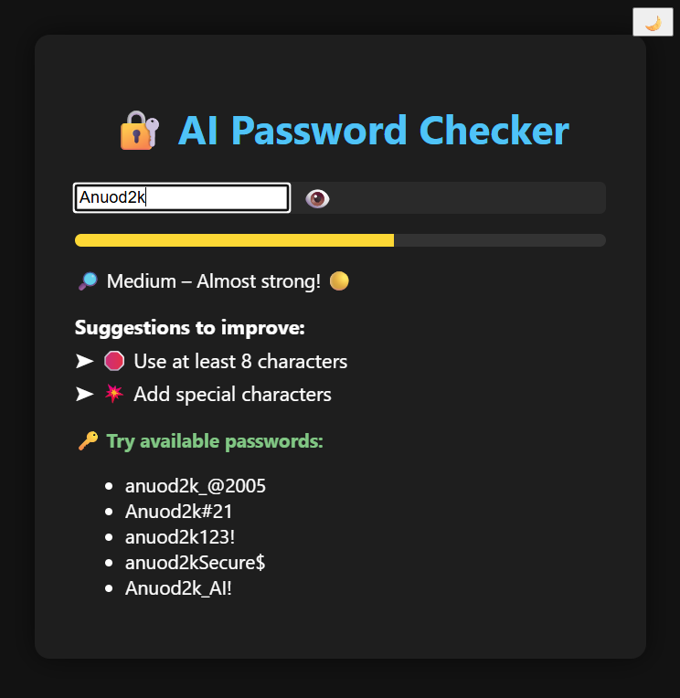
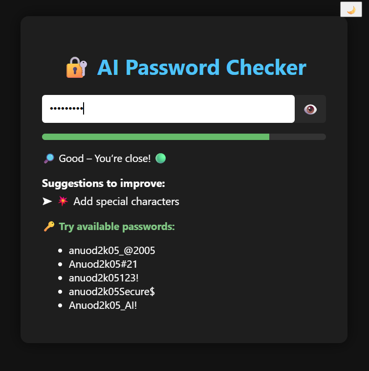
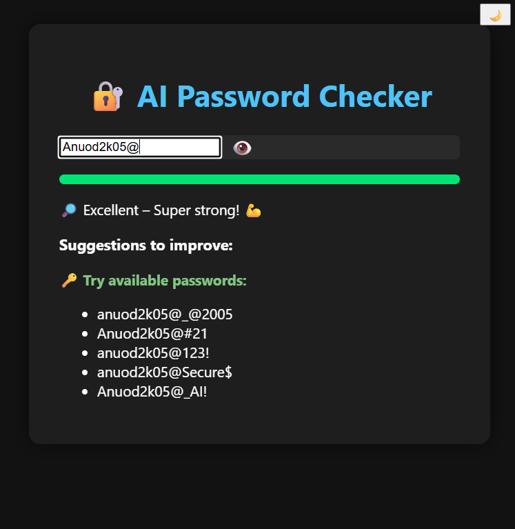

# ✅ 🔐 AI Password Checker

An interactive and visually responsive tool that checks your password strength in real time.
Using HTML, CSS, and JavaScript.

---

### ✅ 🚀 Features

🔒 Real-time password strength meter
🎨 Color-coded strength indicator
🔍 Checks for:
• Minimum 8 characters
• Lowercase letters
• Uppercase letters
• Numbers
• Special characters
💡 Shows improvement tips
🤖 Suggests strong AI-style password options
👁️ Show/Hide password toggle
🌙/🌞 Light/Dark mode switch
📱 Responsive design for all screen sizes

---

✅ 🛠️ Technologies Used

🧱 HTML5
🎨 CSS3 (with animations)
📜 JavaScript (Vanilla)

---

✅ 📸 Sample Output

  
  
  

